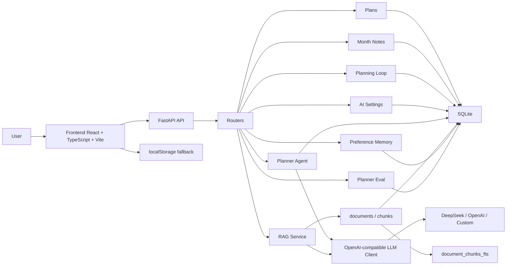
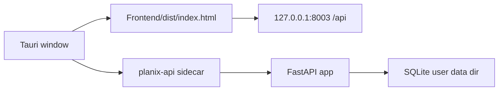

# Planix Architecture



## Data Flow

The frontend is API-first for plans, month notes, and AI settings. When the backend is available, data is stored in SQLite through FastAPI. Independent demo features may use their existing local fallback, but formal Planning fails closed at its current native node when the selected model is unavailable.

## Desktop Flow



Phase 7 prepares the Tauri v2 scaffold in `apps/desktop`, the PyInstaller entry in `scripts/pyinstaller`, and PowerShell build scripts in `scripts`. The packaged desktop app is expected to start the `planix-api` sidecar with `PLANIX_ENV=desktop`, so SQLite resolves to `%APPDATA%\Planix\planix.db` unless `PLANIX_DB_PATH` overrides it.

Development mode points the Tauri window to `http://127.0.0.1:5176`, while production loads `index.html` from `Frontend/dist`.

## Planning Loop

The production planning path has one entry point: `get_planning_orchestrator()` returns `CognitiveOSRuntime`, which executes the canonical Harness-owned graph. The path is Understanding -> confirmation -> constraints/context -> direct Plan generation -> deterministic and semantic validation -> issue-scoped repair when required -> Schedule generation and validation -> deterministic Calendar proposal -> Final Review -> version-bound final approval -> Calendar permission gate -> outcome feedback and learning. No intermediate planning pipeline or alternate formal graph exists. Retired sessions remain read-only and cannot enter an executable graph.

## Independent Goal Utilities

1. `POST /api/planning/goal-plan` retrieves matching knowledge-base chunks, turns a long-term goal into phases and today tasks, then stores the result in `planning_goals`.
2. The frontend can apply generated tasks into the current day's `plans`.
3. `POST /api/planning/daily-review` reads today's task state, stores a review in `daily_reviews`, and returns a replan preview for the next day.
4. Replan previews never modify calendar data until `POST /api/planning/replan/apply` is called.

## RAG Flow

1. `POST /api/rag/documents` saves pasted material metadata into `documents`.
2. `POST /api/rag/documents/upload` accepts `.txt/.md` multipart uploads and turns them into the same document records.
3. The backend splits content into overlapping chunks and stores them in `document_chunks`.
4. Each chunk is mirrored into `document_chunks_fts`, a SQLite FTS5 virtual table.
5. `POST /api/rag/query` builds an FTS query, ranks matches with `bm25(document_chunks_fts)`, and returns stable source objects.
6. Source objects include `documentId`, `title`, `chunk`, `score`, and `chunkIndex`.
7. The legacy `POST /api/rag/ingest` endpoint remains available and writes through the new document path.

## Evaluation Flow

`POST /api/eval/planner` is deterministic and does not call an LLM. It scores planning quality across six dimensions: goal clarity, material grounding, time feasibility, preference personalization, execution loop, and portfolio signal. This keeps the feature testable without API keys while still producing resume-friendly evaluation evidence.

## LLM Flow

1. The user saves provider, base URL, model, API key, temperature, and timeout in the AI workspace.
2. `GET /api/ai/settings` returns only public settings and `hasApiKey`.
3. `LlmClient` reads the latest settings for each request.
4. If provider is `mock` or no key is available, AI features return deterministic mock output.
5. If a key exists, `LlmClient` calls an OpenAI-compatible `/v1/chat/completions` endpoint.
6. Success and failure records are written to `ai_runs`.

## Backend Layout

```text
Backend/backend/app/
  main.py
  db.py
  desktop_paths.py
  schemas.py
  routers/
    health.py
    plans.py
    month_notes.py
    planning.py
    settings.py
    agent.py
    rag.py
    preferences.py
  services/
    ai_settings.py
    llm.py
    planning.py
    plans.py
    month_notes.py
    planner.py
    rag.py
    memory.py
    evaluator.py
    tools.py
```

## SQLite Tables

| Table | Purpose |
| --- | --- |
| `plans` | Daily task records |
| `month_notes` | Monthly notes |
| `planning_goals` | Saved long-term goal plans, phases, and generated tasks |
| `daily_reviews` | Daily review records, suggestions, and replan previews |
| `ai_settings` | Provider, model, key state, temperature, and timeout |
| `user_preferences` | Preference memory |
| `documents` | Pasted material metadata, source type, summary, content hash |
| `document_chunks` | Retrieval chunks from pasted materials or TXT/MD uploads |
| `document_chunks_fts` | SQLite FTS5 virtual table used for BM25 retrieval |
| `ai_runs` | AI call logs, mock fallback records, and error records |

## Interview Talking Points

- The app moved from localStorage-only storage to an API-first SQLite data layer.
- AI provider settings are persisted locally but API keys are not returned to the browser after save.
- The LLM client is OpenAI-compatible, so DeepSeek, OpenAI, or a custom compatible endpoint can be swapped.
- Planner and RAG services read the latest model settings on each request.
- RAG is local-first: no vector database is required, but results still include ranked citations.
- Goal planning is grounded with retrieved chunks when matching materials exist.
- The planning loop separates AI preview from data mutation, so users confirm replan tasks before they touch the calendar.
- Mock fallback keeps the project demoable without paid credentials.
